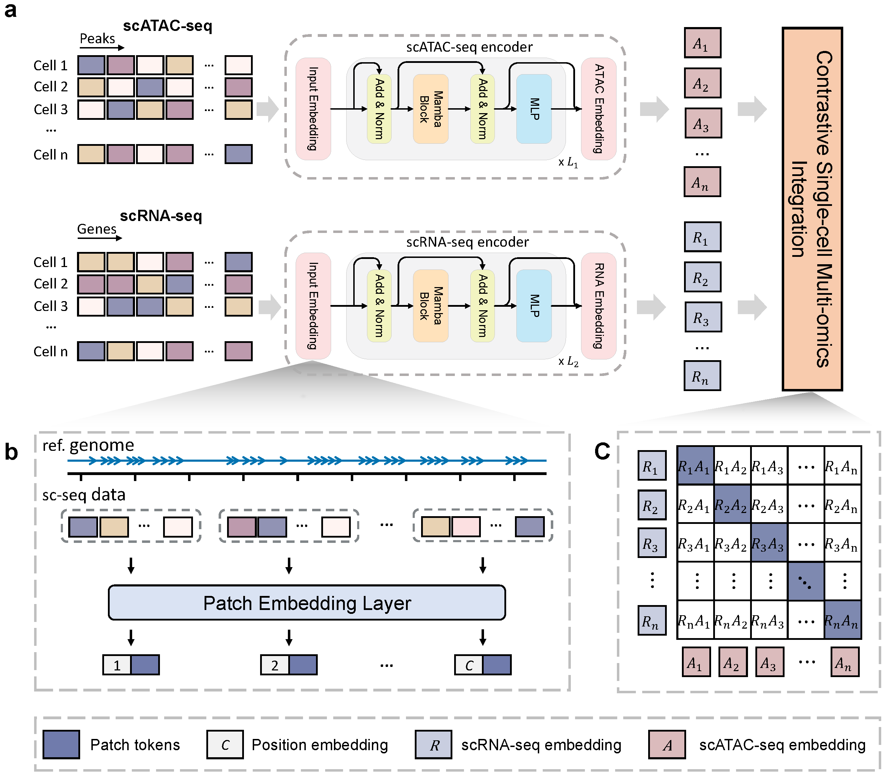

# scMamba

This is the official codebase for **scMamba: A Scalable Foundation Model for Single-Cell Multi-omics Integration Beyond Highly Variable Feature Selection**.



## About

scMamba is a foundation model designed to integrate single-cell multi-omics data without the need for prior feature selection while preserving genomic positional information. scMamba introduces a patch-based tokenization strategy that treats genomics regions as words (tokens) and cells as sentences. Building upon the concept of state space duality, scMamba distills rich biological insights from high-dimensional, sparse single-cell multi-omics data. Additionally, our novel contrastive learning approach, enhanced with cosine similarity regularization, enables superior alignment across omics layers compared to traditional methods. Systematic benchmarking across multiple datasets demonstrates that scMamba significantly outperforms state-of-the-art methods in preserving biological variation, aligning omics layers, and enhancing key downstream tasks such as clustering, cell type annotation, and trajectory inference. Our findings position scMamba as a powerful tool for large-scale single-cell multi-omics integration, capable of handling large-scale atlases and advancing biological discovery.

## Installation

- Python 3.10.13

  - `conda create -n your_env_name python=3.10`
- Install ``cuda vewrsion 12.1 `` and ``cudnn``
- Install ``pytorch 2.3.1``
- Install ``causal_conv1d`` and ``mamba``

  - `pip install causal_conv1d==1.4.0`
  - `pip install mamba==2.2.2`
- Requirements: requirements.txt

  - `pip install -r requirements.txt`
- Install [flash-attention](https://github.com/Dao-AILab/flash-attention)

### Note

If ``cuda`` and ``cudnn`` aren't installed, ``causal_conv1d`` and ``mamba-ssm`` will be installed unsuccessfully.

- Install ``causal_conv1d``

```bash
git clone https://github.com/Dao-AILab/causal-conv1d.git
cd causal-conv1d
git checkout v1.4.0
pip install .

```

- Install ``mamba-ssm``

```bash
git clone https://github.com/state-spaces/mamba.git
cd mamba
git checkout v2.2.2
pip install -e .
```

## Quick Start

### scMamba Model Ckeckpoints

The checkpoints and datasets for the scMamba model are available via [dropbox](https://www.dropbox.com/scl/fo/g64416xvv1fjd36l1z7nx/AKcB6XbOFHLPFHQX68TpGCQ?rlkey=1i3grodznoch33gihjqn74oc9&st=cvwgi5n5&dl=0). We might update our checkpoints from time to time.

**Inference example**
To perform inference with a pretrained model:

```bash
python inference.py \
    --device cuda:1 \
    --checkpoints results/checkpoints/PBMC.pt \
    --batch_size 128 \
    --data_dir datasets/multiome/PBMC.h5mu  \
    --config config_files/scmamba2_config.json \
    --results_dir results/benckmark
```

Make sure to adjust the paths to match your environment.

### Model Train

#### Single-GPU training

To train the model on a single GPU, execute the following command:

```bash
python train_script.py --device cuda:1 --data_dir /datasets/PBMC10k.h5mu
```

#### Multi-GPU Training with Accelerate

We leverage the `accelerate` library in conjunction with `DeepSpeed` to facilitate efficient distributed training across multiple GPUs.

**Prerequisites**

Install [accelerate](https://huggingface.co/docs/accelerate/index)

- `pip install accelerate`

Install [deepspeed](https://www.deepspeed.ai/getting-started/)

- `pip install deepspeed`

To launch training with multi-GPU support via accelerate, use:

```bash
sh run_acclerate.sh
```

**Note** : Please ensure that the `run_accelerate.sh` script is modified to match your local environment (e.g., paths, device settings, number of processes).
