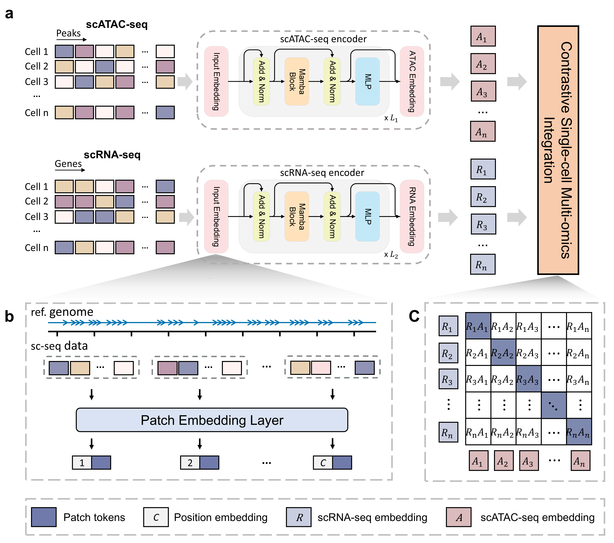

# scMamba

This is the official codebase for **scMamba: A Scalable Foundation Model for Single-Cell Multi-omics Integration Beyond Highly Variable Feature Selection**.



The advent of single-cell multi-omics technologies has enabled the simultaneous profiling of diverse molecular layers within individual cells. Integrating such multimodal data provides unprecedented insights into cellular identity, regulatory processes, and disease mechanisms. However, it remains challenging, as current methods often rely on selecting highly variable genes or peaks during preprocessing, which may inadvertently discard crucial biological information. Here, we present scMamba, a foundation model designed to integrate single-cell multi-omics data without the need for prior feature selection while preserving genomic positional information. scMamba introduces a patch-based tokenization strategy that treats genomics regions as words (tokens) and cells as sentences. Building upon the concept of state space duality, scMamba distills rich biological insights from high-dimensional, sparse single-cell multi-omics data. Additionally, our novel contrastive learning approach, enhanced with cosine similarity regularization, enables superior alignment across omics layers compared to traditional methods. Systematic benchmarking across multiple datasets demonstrates that scMamba significantly outperforms state-of-the-art methods in preserving biological variation, aligning omics layers, and enhancing key downstream tasks such as clustering, cell type annotation, and trajectory inference. Our findings position scMamba as a powerful tool for large-scale single-cell multi-omics integration, capable of handling large-scale atlases and advancing biological discovery.

## Installation

- Python 3.10.13

  - `conda create -n your_env_name python=3.10`
- Install ``cuda vewrsion 12.1 `` and ``cudnn``
- Install ``pytorch 2.3.1``
- Requirements: requirements.txt

  - `pip install -r requirements.txt`
- Install ``causal_conv1d`` and ``mamba``

  - `pip install causal_conv1d==1.4.0`
  - `pip install mamba==2.2.2`

### Note

If ``cuda`` and ``cudnn`` aren't installed, ``causal_conv1d`` and ``mamba-ssm`` will be installed unsuccessfully.

- Install ``causal_conv1d``

```bash
git clone https://github.com/Dao-AILab/causal-conv1d.git
cd causal-conv1d
git checkout v1.4.0
pip install .

```

- Install ``mamba-ssm``

```bash
git clone https://github.com/state-spaces/mamba.git
cd mamba
git checkout v2.2.2
pip install -e .
```

## Train

```bash
python train_script.py --data_dir /datasets/PBMC10k.h5mu
```
